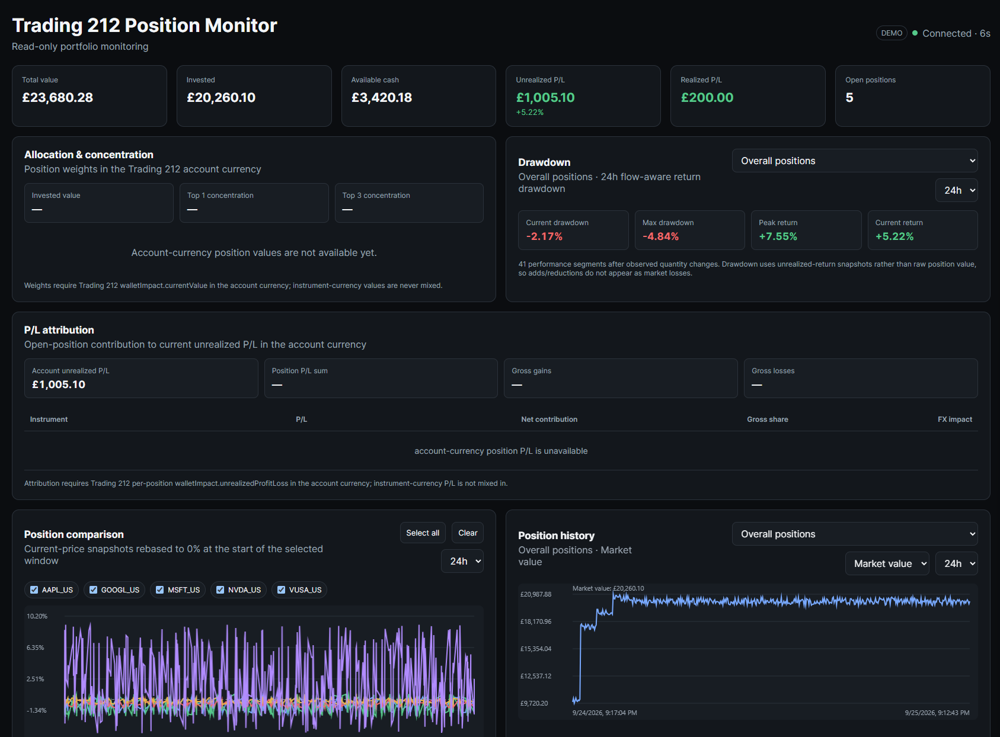
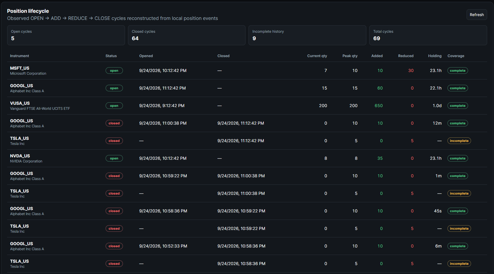

# Trading 212 Position Monitor

A self-hosted, read-only Trading 212 portfolio monitoring and analytics dashboard.

> **Unofficial:** This is an independent project and is **not affiliated with or endorsed by Trading 212**. Trading 212 is a registered trademark of its respective owners.

[](https://github.com/chenyang9779/t212_monitoring/actions)




## Features

- Live account and open-position monitoring
- Historical SQLite snapshots with WAL mode
- Position OPEN / ADD / REDUCE / CLOSE lifecycle tracking
- Allocation and exposure analytics (quoted-currency & instrument-type)
- Drawdown analysis and P&L attribution
- Pending orders, historical orders, and transactions (where API permissions allow)
- Instrument metadata caching
- Sampled position marks for market-data analytics
- CSV / JSONL downloads with formula-injection mitigation
- SSE (Server-Sent Events) live feed for browsers
- Health/readiness probes
- Docker-first deployment, single-worker process-local architecture
- **Read-only:** contains no order-placement code

## Screenshots

> **Note:** All screenshots use synthetic / demo portfolio data — no real account or transaction information is shown.

| Dashboard Overview | Position Lifecycle & Analytics |
|---|---|
|  |  |

## Quick Start

### Try the UI with synthetic data

No Trading 212 account or API credentials are required.

```bash
git clone https://github.com/chenyang9779/t212_monitoring.git
cd t212_monitoring
cp .env.example .env
mkdir -p data
```

Set demo mode in `.env`:

```dotenv
T212_DEMO=true
```

```bash
docker compose up -d --build
```

Open the dashboard at `http://127.0.0.1:8000`.

### Connect a Trading 212 account

You will need a read-only API key from Trading 212.

```bash
git clone https://github.com/chenyang9779/t212_monitoring.git
cd t212_monitoring
cp .env.example .env
mkdir -p data
```

Edit `.env` with your Trading 212 read-only credentials:

```dotenv
T212_DEMO=false
T212_API_KEY=your_api_key_here
T212_API_SECRET=your_api_secret_here
T212_ENV=demo
```

```bash
docker compose up -d --build
```

> **Important:** Use a **read-only** Trading 212 API key — do not grant service execution or order permissions.

Open the dashboard at `http://127.0.0.1:8000`.

## Security

> **Security note:** This application exposes sensitive portfolio and account information (balance, positions, P&L, transaction history) and does **not** include built-in user authentication. Keep it bound to localhost unless placed behind an authenticated private-access layer.

- Use a **read-only** Trading 212 API key. Do not grant service execution or order permissions to the monitoring key.
- Keep API credentials only in `.env`. **Never commit `.env` or hard-code credentials in source.**
- The service binds to `127.0.0.1` by default. Do not expose the port directly to the internet.
- For remote access, use an SSH tunnel, Tailscale, VPN, or a reverse proxy with authentication.
- For live accounts, consider restricting the API key to your host's IP/CIDR in Trading 212 settings.
- The SQLite database at `data/monitor.db` stores historical portfolio and transaction data. Treat it as private account data.
- If a separate quant or execution service is added later, give order-capable credentials to that service only. The dependency must be one-way: quant/execution reads from the monitor; the monitor does not depend on them.

## Table of Contents

- [Features](#features)
- [Screenshots](#screenshots)
- [Quick Start](#quick-start)
- [Security](#security)
- [Docker Deployment](#docker-deployment)
- [Configuration](#configuration)
- [Synthetic Demo Mode](#synthetic-demo-mode)
- [API Routes](#api-routes)
- [Operational Hardening](#operational-hardening)
- [Instrument Metadata and Exposure](#instrument-metadata-and-exposure)
- [SSE Live Stream](#sse-live-stream)
- [Export API](#export-api)
- [Market-Data Model](#market-data-model)
- [Data Model Note](#data-model-note)
- [Quant Architecture](#quant-architecture)
- [Development](#development)
- [Contributing](CONTRIBUTING.md)
- [License](#license)
- [Disclaimer](#disclaimer)

## Docker Deployment

Docker Compose is the primary deployment method. The image contains the application and Python dependencies; credentials remain outside the image in the local `.env` file.

**Requirements:**

- Docker Engine
- Docker Compose plugin (`docker compose`)

**Initial setup:**

```bash
cp .env.example .env
mkdir -p data
```

**Build and launch:**

```bash
docker compose up -d --build
```

**Check the container:**

```bash
docker compose ps
docker compose logs -f monitor
```

Open the dashboard at:

```
http://127.0.0.1:8000
```

The default port binding is `127.0.0.1:8000` (localhost only). To change:

```dotenv
T212_BIND_ADDRESS=127.0.0.1
T212_HOST_PORT=8000
```

SQLite data is persisted through the bind mount:

```
./data -> /app/data
```

The application listens on all interfaces (`0.0.0.0`) inside the container so Docker port forwarding works correctly.
`T212_BIND_ADDRESS` controls the **host-side** Docker port binding only — it does not affect what the application listens on inside the container.

The image runs exactly **one Uvicorn worker**. This is intentional because the monitor loop, SSE event broker, and metadata cache are process-local.

**Stop the service (database preserved):**

```bash
docker compose down
```

**Update and restart:**

```bash
git pull origin master
docker compose up -d --build
```

## Configuration

```dotenv
T212_API_KEY=
T212_API_SECRET=
T212_ENV=demo
T212_POLL_SECONDS=6
T212_SNAPSHOT_SECONDS=30
T212_DB_PATH=data/monitor.db
T212_RAW_RETENTION_DAYS=
T212_POSITION_LOSS_ALERT_PCT=
T212_TOTAL_LOSS_ALERT_PCT=

# Docker Compose only
T212_BIND_ADDRESS=127.0.0.1
T212_HOST_PORT=8000
```

Alert thresholds are disabled when blank. Example: a value of `8` means an alert is recorded when unrealized return is `<= -8%`.

`T212_RAW_RETENTION_DAYS` is also disabled when blank. When configured, the monitor periodically removes older account snapshots, position snapshots, and sampled market quotes while keeping low-volume audit data such as position events and alerts.

The poll interval must be at least five seconds because the account-summary endpoint is rate-limited more strictly than the positions endpoint.

## Synthetic Demo Mode

```dotenv
T212_DEMO=true
```

When enabled:

- **No Trading 212 API calls** are made — the broker connection is skipped entirely.
- **No credentials required** — `T212_API_KEY` and `T212_API_SECRET` are ignored.
- **Separate database** — defaults to `data/demo-monitor.db` so it never overwrites the live `data/monitor.db`.
- **Fully synthetic data** — the generator creates realistic portfolio history (24 h simulated, 6 positions, all lifecycle events) using deterministic randomness for reproducible screenshots.
- Suitable for trying the dashboard, generating documentation screenshots, or testing UI changes without any broker access.

## API Routes

### Core monitoring

- `GET /healthz` — liveness probe
- `GET /readyz` — readiness probe (200 or 503)
- `GET /api/status` — current monitor status
- `GET /api/operations` — startup report, readiness, SSE stream counters
- `GET /api/storage` — SQLite database status
- `GET /api/latest` — latest portfolio state
- `GET /api/instruments[?refresh=true]` — instrument metadata
- `GET /api/exposure[?refresh_metadata=true]` — allocation & exposure
- `GET /api/history?hours=24` — account history
- `GET /api/position-history?ticker=...&hours=24` — position history
- `GET /api/position-events?limit=100` — lifecycle events
- `GET /api/position-lifecycles` — reconstructed position lifecycles
- `GET /api/data-quality?hours=24` — data quality indicators
- `GET /api/reconciliation?event_limit=50&tolerance_seconds=180` — event reconciliation
- `GET /api/drawdown?hours=24[&ticker=...]` — drawdown analytics
- `GET /api/pnl-attribution` — P&L attribution
- `GET /api/alerts?limit=50` — monitor alerts

### Live stream

- `GET /api/stream` — SSE live feed
- `GET /api/stream/status` — stream subscriber stats

### Broker data

- `GET /api/orders/pending` — pending orders
- `GET /api/orders/history?limit=50` — historical orders
- `GET /api/transactions?limit=50` — transactions

### Market-data store

- `GET /api/market/catalog` — market data catalog
- `GET /api/market/quotes?ticker=...&hours=24` — sampled quotes
- `GET /api/market/bars?ticker=...&hours=24&minutes=5` — aggregated bars

Supported sampled-bar intervals: `1, 5, 15, 30, 60, 240, 1440` minutes.

## Export API

All export endpoints are read-only and accept `format=csv` (default) or `format=jsonl`.

### Local datasets

- `GET /api/export/positions?format=csv`
- `GET /api/export/account-history?hours=24&format=csv`
- `GET /api/export/position-history?ticker=...&hours=24&format=csv`
- `GET /api/export/position-events?format=csv`
- `GET /api/export/alerts?limit=500&format=jsonl`
- `GET /api/export/market-quotes?ticker=...&hours=24&format=csv`
- `GET /api/export/market-bars?ticker=...&hours=24&minutes=5&format=csv`

### Broker-backed datasets

- `GET /api/export/orders/history?limit=50&format=csv`
- `GET /api/export/transactions?limit=50&format=csv`

Broker-backed exports intentionally fetch at most one Trading 212 history page per request. If more broker pages exist, the response includes `X-Export-Has-More: true` to prevent rate-limit exhaustion.

CSV string values starting with formula prefixes (`=`, `+`, `-`, `@`) are prefixed with `'` to reduce spreadsheet formula-injection risk.

## Operational Hardening

`GET /healthz` is a lightweight liveness endpoint. It answers while the process is running and reports any startup configuration or resource issues.

`GET /readyz` is stricter. It returns HTTP `200` only when startup checks succeeded, SQLite is queryable, the broker monitor is connected, and the last successful Trading 212 sync is fresh. Otherwise it returns HTTP `503` with reasons such as `broker_not_connected`, `broker_sync_stale`, `database_unavailable`, or `startup_checks_failed`.

`GET /api/operations` exposes the startup report, current readiness, and SSE stream counters for diagnostics.

Every HTTP request receives an `X-Request-ID` response header. Application request logs are emitted as one-line JSON with UTC timestamps, log level, request ID, method, path, status code, and duration. Unhandled exceptions are logged with the same request ID.

The FastAPI lifespan logs explicit startup/stopping/stopped events and always awaits `monitor.stop()` during shutdown.

## Instrument Metadata and Exposure

`GET /api/instruments` fetches Trading 212's read-only instrument metadata and caches it in memory for six hours. `?refresh=true` forces a refresh. Metadata failures do not mark the core portfolio monitor disconnected.

`GET /api/exposure` joins current open positions to that metadata and aggregates **account-currency position values** by:

- instrument quoted currency, and
- Trading 212 instrument type.

The exposure code deliberately does not invent sector or country classifications.

## SSE Live Stream

`GET /api/stream` is a read-only Server-Sent Events feed. A new connection first receives a `ready` event with current monitor status and latest portfolio state. Subsequent events are emitted from the existing monitor polling loop; opening the stream does not create extra Trading 212 polling requests.

Current event names:

- `ready` — current monitor status and latest portfolio on connection.
- `portfolio` — normalized account and open-position state after a successful poll.
- `snapshot` — emitted after a local SQLite snapshot is saved.
- `position_event` — an observed OPEN / ADD / REDUCE / CLOSE quantity change.
- `alert` — a newly activated monitor alert.
- `monitor_error` — a Trading 212 monitoring error.
- `maintenance` / `maintenance_error` — retention-maintenance status.

The server sends comment heartbeats every 15 seconds when no event is available. Each subscriber has a bounded in-memory queue; slow consumers drop oldest pending events rather than blocking the broker polling loop.

## Market-Data Model

The monitor stores sampled Trading 212 position marks in a separate `market_quotes` table with source `t212_position`.

> **Important:** These are **sampled broker position marks**, not exchange tick data and not authoritative exchange OHLC bars. The `/api/market/bars` endpoint aggregates the observed samples into OHLC-style buckets for research convenience. For production-grade quant research, add a dedicated external market-data provider and store that feed under a separate source.

## Data Model Note

Trading 212 reports account summary values in the primary account currency. Position `averagePricePaid` and `currentPrice` are instrument-currency values. Cross-position portfolio analytics use account-currency wallet-impact fields when available and avoid summing incompatible instrument currencies.

## Quant Architecture

The quant component should be a separate service or repository. The monitor should remain the read-only broker-state and data-capture service.

**Recommended boundary:**

```text
Trading 212
    │
    ▼
t212_monitoring
    ├── account snapshots
    ├── position snapshots
    ├── position events
    ├── broker orders / transactions
    └── sampled market quotes
            │
            │ read-only data contract
            ▼
    quant_service
        ├── feature generation
        ├── signals
        ├── portfolio construction
        ├── risk
        ├── backtest / paper mode
        └── optional execution adapter
```

For a local prototype, the quant service can open `data/monitor.db` in SQLite read-only mode. For a cleaner long-term boundary, prefer consuming the monitor's HTTP API, export endpoints, or SSE notifications so the quant service does not depend on this repository's SQLite schema.

The monitor must never depend on the quant service to keep collecting broker state. The dependency is one-way: quant reads monitoring data; monitoring does not import strategy code.

## Development

Running directly on the host is supported for development. Python 3.11+ is recommended.

```bash
python -m venv .venv
source .venv/bin/activate
pip install -r requirements-dev.txt
python -m compileall -q app tests
python -m pytest -q
```

Run the server directly:

```bash
python -m uvicorn app.main:app --host 127.0.0.1 --port 8000
```

## Contributing

See [CONTRIBUTING.md](CONTRIBUTING.md) for guidelines on submitting pull requests, running tests, and handling security-sensitive changes.

## License

This project is licensed under the [MIT License](LICENSE).

## Disclaimer

This software is provided for monitoring and research purposes. It is not financial advice and does not execute trades.

